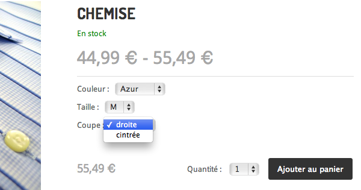
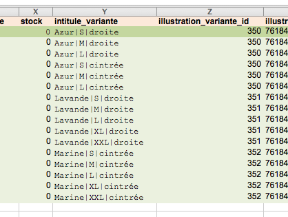

# Créer des variantes multi-critères avec son site Kiubi

## Introduction

Ce dépôt est un tutoriel qui explique comment utiliser l'API de son site [Kiubi](http://www.kiubi.com) pour créer des variantes multi-critères de produit.

## Prérequis

Ce tutoriel suppose que vous avez un site Kiubi et qu'il est bien configuré : 

 - l'API est activée
 - l'e-commerce est activé
 - le site est en thème personnalisé, basé sur Shiroi

Il est préférable d'être à l'aise avec la manipulation des thèmes personnalisés. En cas de besoin, le [guide du designer](http://doc.kiubi.com) est là.

Ce tutoriel est applicable à tout thème graphique mais les exemples de codes donnés sont optimisés pour un rendu basé sur le thème Shiroi.

## Ajout d'un groupe de listes déroulantes représentant les différentes options d'un produit 

Pour y arriver, on utilise ici plusieurs composants :

 - le framework jQuery pour les manipulations javascript de base
 - le client Javascript API Front-office de Kiubi (qui est un plugin jQuery) pour récupérer les produits
 - le plugin jQuery *variantes_multicriteres.js* disponible dans ce dépôt

### Mise en place 

La première étape, consiste à créer un type de produit par groupe de critères. (Exemple : le type t-shirt pour le groupe de critères coloris, taille et coupe. Le groupe Disque dur pour les critères capacité et vitesse).

Pour créer un nouveau type de produit, copier le dossier `/theme/fr/produits/t-shirt` de ce dépôt dans votre thème graphique. Ouvrir le fichier `config.xml`, il contient les informations suivantes :

<pre lang="xml">
&lt;?xml version="1.0" encoding="iso-8859-1"?&gt;
&lt;!-- 
Configuration du produit "T-shirt"
--&gt;
&lt;!DOCTYPE type SYSTEM "http://www.kiubi-admin.com/DTD/typesproduits.dtd"&gt; 
&lt;type tri="1"&gt;
	&lt;desc&gt;T-shirt&lt;/desc&gt;
	&lt;listechamps&gt;
	&lt;/listechamps&gt;
	&lt;extra&gt;
		&lt;critere&gt;Coloris&lt;/critere&gt;
		&lt;critere&gt;Taille&lt;/critere&gt;
		&lt;critere&gt;Coupe&lt;/critere&gt;
	&lt;/extra&gt;
&lt;/type&gt;
</pre>	

Le champ extra contient ici la liste des critères de notre type de produit "T-shirt".

Créer un nouveau produit de type "T-shirt". Il convient ensuite de nommer les variantes de ce produit selon une nomenclature strict. 

Afin de séparer les différentes options d'une variante nous allons choisir un caractère rarement utilisé afin de séparer ces options : `|`

Créer plusieurs variantes avec comme intitulé de variante les valeurs suivantes :

	Azur|S|droite
	Azur|M|droite
	Azur|L|droite
	Azur|S|cintrée
	Azur|M|cintrée
	Azur|L|cintrée
	Lavande|S|droite
	Lavande|M|droite
	Lavande|L|droite
	Lavande|XL|droite
	Lavande|XXL|droite
	Marine|S|cintrée
	Marine|M|cintrée
	Marine|L|cintrée
	Marine|XL|cintrée
	Marine|XXL|cintrée

Un fichier excel d'exemple est disponible dans le dossier `sample/`du présent dépôt. Vous pouvez l'importer pour alimenter cet exemple avec des produits pré-configurés.

Ajouter les fichiers javascript du répertoire `/theme/fr/templates` de ce dépôt dans le répertoire du même nom de votre thème graphique.

#### Listing produit

Editer le fichier `liste.html` du widget "liste de produit" et inclure les fichiers javascripts suivants.

*Note :* Ces fichiers peuvent également être inclus directement dans le `<head>` des templates du thème. Le framework jQuery étant inclus de base dans Shiroi, ce dernier n'est pas listé ci-après, mais reste nécessaire au bon fonctionnement du plugin.

<pre lang="html">
&lt;script type="text/javascript" src="{racine}/{theme}/{lg}/templates/variantes_multicriteres.min.js"&gt;&lt;/script&gt;
&lt;script type="text/javascript" src="{cdn}/js/kiubi.api.pfo.jquery-1.0.min.js"&gt;&lt;/script&gt;
</pre>

Avant la fin du bloc `<!-- END:produits -->` ajouter le code suivant : 

<pre lang="javascript">
jQuery(function($){
	
	var query = kiubi.get('/catalog' + ('{widget_categorie_id}' ? '/categories/{widget_categorie_id}' : '') + '/products.json', {
		'limit'        : parseInt("{widget_limit}"),
		'page'         : parseInt("{num_page}")-1,
		'sort'         : "{widget_order_api}",
		'available'    : "{widget_dispo}",
		'in_stock'     : "{widget_stock}",
		'extra_fields' : 'price_label,variants',
		'tags'         : "{widget_tags}",
		'tags_rule'    : ("{widget_tags_logique}" == "et" ? "and" : "or")
	});

	query.done(function(meta, data){
		
		$.each(data, function(i, product){
			var $form = $('input[name=pid][value='+product.id+']').closest('form');
			var $container = $('select[name=vid]', $form).wrap('&lt;div&gt;').parent();
			$container.variantes_multicriteres(product);
		});
		
	});
	
});
</pre>

#### Détail produit

Afin d'intégrer facilement la fonctionnalité de découpage de variantes en sélecteur multi-critères, nous allons créer un fragment de template.

Copier le fichier `/theme/fr/includes/variantes_multicriteres.html` de ce dépôt dans le dossier `includes` de votre thème.

Dans le Back-office du site, éditer une mise en page de type "Détail de produit". 

Placer le widget "Fragment de template" dans la page. Editer la configuration du widget et choisir le template `variantes_multicriteres`. 

La page de détail des produits de type "t-shirt" affichent désormais un sélecteur multi-critères.

---

### Explication

Examinons en détail le script inséré dans le template liste.html

<pre lang="javascript">
jQuery(function($){
	
	var query = kiubi.get('/catalog' + ('{widget_categorie_id}' ? '/categories/{widget_categorie_id}' : '') + '/products.json', {
		'limit'        : parseInt("{widget_limit}"),
		'page'         : parseInt("{num_page}")-1,
		'sort'         : "{widget_order_api}",
		'available'    : "{widget_dispo}",
		'in_stock'     : "{widget_stock}",
		'extra_fields' : 'price_label,variants',
		'tags'         : "{widget_tags}",
		'tags_rule'    : ("{widget_tags_logique}" == "et" ? "and" : "or")
	});
</pre>

Cette requête permet de récupérer l'ensemble des produits tels qu'ils sont configurés dans le widget. Les balises kiubi sont substituées par leur valeur lors du rendu de la page.

<pre lang="javascript">
	query.done(function(meta, data){
		
		$.each(data, function(i, product){
</pre>

On itère sur l'objet data. La fonction définie ici est appelé pour chaque produit du catalogue contenue dans le résultat de la requête. 

On recherche à présent le formulaire d'ajout au panier de ce produit :

<pre lang="javascript">
			var $form = $('input[name=pid][value='+product.id+']').closest('form');
</pre>

On recherche ensuite le sélecteur multiple de variante d'origine, on l'entoure d'une balise `
` :

<pre lang="javascript">
			var $container = $('select[name=vid]', $form).wrap('&lt;div&gt;').parent();
</pre>

`$container` correspond à l'objet jQuery dans lequel seront placés les listes déroulantes.

On instance pour finir le plugin `variantes_multicriteres` avec comme paramètre le produit.

<pre lang="javascript">
			$container.variantes_multicriteres(product);
		});
	});
</pre>

--- 

#### Fonctionnement interne du plugin variantes_multicriteres

Lors de l'instanciation du plugin `variantes_multicriteres` un objet `variants` est construit. Cet objet à pour clés chacun des intitulés de variante, et pour valeurs associées les identifiants uniques de ces variantes.

*Exemple :*

<pre lang="javascript">
>>> variants
{
	"Azur|S|droite": 59,
	"Azur|M|droite": 60,
	"Azur|L|droite": 61,
	"Azur|S|cintrée": 62,
	"Azur|M|cintrée": 63,
	"Azur|L|cintrée": 64,
	"Lavande|S|droite": 65,
	"Lavande|M|droite": 66,
	"Lavande|L|droite": 67,
	"Lavande|XL|droite": 68,
	"Lavande|XXL|droite": 69,
	"Marine|S|cintrée": 70,
	"Marine|M|cintrée": 71,
	"Marine|L|cintrée": 72,
	"Marine|XL|cintrée": 73,
	"Marine|XXL|cintrée": 74
}
</pre>

Cet objet est ensuite parsé par la méthode `decompose()` incluse dans le code javascript du plugin, avec en second paramètre le séparateur utilisé :

<pre lang="javascript">
>>> variants = decompose(variants, "|");
</pre>

L'objet `variants` est désormais recomposé en fonction de 3 niveaux de clés : la couleur, la taille, et la coupe :

<pre lang="javascript">
>>> variants
{
	"Azur": {
		"S": {
			"droite": 59,
			"cintrée": 62 },
		"M": {
			"droite": 60,
			"cintrée": 63 },
		"L": {
			"droite": 61,
			"cintrée": 64 }
	},
	"Lavande": {
		"S": { "droite": 65 },
		"M": { "droite": 66 },
		"L": { "droite": 67 },
		"XL": { "droite": 68 },
		"XXL": { "droite": 69 }
	},
	"Marine": {
		"S": { "cintrée": 70 },
		"M": { "cintrée": 71 },
		"L": { "cintrée": 72 },
		"XL": { "cintrée": 73 },
		"XXL": { "cintrée": 74 }
	}
}
</pre>

Cet objet est ensuite parcouru de façon récursive par la méthode `dropdown` afin de générer les différentes listes déroulantes.

Enfin, lorsque une option sans sous-objet est sélectionnée par l'internaute, l'identifiant est utilisé afin de mettre à jour le prix ainsi que la valeur du champ masqué `input[name=vid]`.

## Compatibilité avec le plugin loadmore.js

Pour activer cette fonctionnalité sur des éléments ajoutés dynamiquement à un listing au moyen du plugin [*loadmore.js*](https://github.com/Trolldidees/kiubi-howto-loadmore), nous devons attacher un listener à l'événement `loadmore.append_item`.

Pour ajouter la fonctionnalité le plugin *variante_multicriteres.js* doit être inclus dans le template `index.html` du widget `liste_produits` :

<pre lang="html">
&lt;script type="text/javascript" src="{racine}/{theme}/{lg}/templates/variantes_multicriteres.min.js"&gt;&lt;/script&gt;
</pre>

Il faut ensuite ajouter le code javascript suivant après la déclaration de la variable `listing` :

<pre lang="javascript">
listing.on('loadmore.append_item', function(e, product){
	var $form = $('input[name=pid][value='+product.id+']').closest('form');
	var $container = $('select[name=vid]', $form).wrap('&lt;div&gt;').parent();
	$container.variantes_multicriteres(product);
});
</pre>

